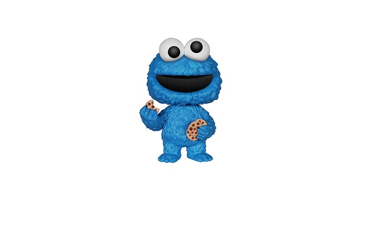

# CookiesHunter
------------------------

AUTHORS : Martin Pettinotti, Marie Bogusz, Thibaud Gil, Diama Fall, Anthoine Pierson, Amandine Poullot, Gabriel Brunet, Kilian Felesmino.
------------------------
`Students project from the University of Poitiers - Master degree Bioengineering and computing "Gphy"`

**Opensource code for the CookiesHunter game.**

***Description of the game :***
___
> You are Cookie-Monster, a famous cookie connoisseur, ready to do anything to get cookies. 
Now you walk down the street and stops in front of the Chip family's house, famous for having the best cookies in the world.
The goal is to retrieve as many cookies as possible and retrieve the Magic Cookie.
To do so, you must go and overcome the family, sometimes answer riddles given by the family and collect objects to get to   the desired cookie.
But, be careful not to get trapped and die.

### How to open the game ?
  
  - First you have to click on blabla
  - Then on blibli
  - And finally you can play, and enjoy our game !
  
### How to play ?

  - On the left up corner, you can see the current room where you are located.
  - Just on the right, this is your inventory. Don't be wooried if you cannot see anything, continue your adventure and see what happen !
  - Just below, you can see the different arrows which allows you to move in an other room. Arrows on the corner are useful to upstairs or downstairs. You can click on the button on the middle to talk with NPC or pick up an item when it display a loop, and fight when it display a spoon ! Be careful ...
  - And finally, at the arrows left, you can see a text box and below the area where you can write your answer to the CookiesHunter's riddle !  

___
The arrows comes from [Flaticon®](https://www.flaticon.com).

This README.md files was writing according to the [Mark Down](https://www.markdownguide.org/basic-syntax/) syntax.
